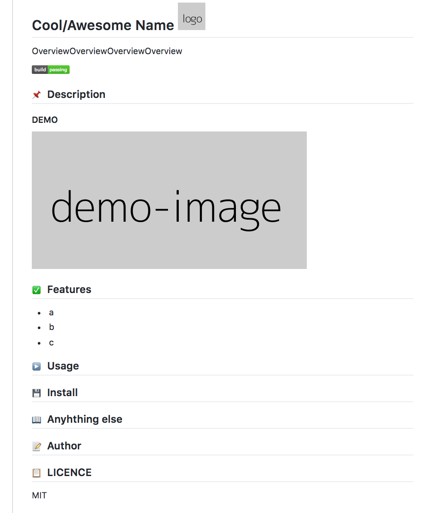

# README-template 

A generic template for README.md

## :pushpin: Description

### DEMO

<!-- add gif image if you like -->

## :white_check_mark: Features
<!-- list up your product features. -->
- Make your product repository looks better

---

## :floppy_disk: Install
### Requirements
<!-- show dependencies first -->
No dependencies :tada:

### Step
1. Copy TEMAPLATE from [here](https://raw.githubusercontent.com/mesh1neko/README-templates/master/TEMPLATE.md)

## :arrow_forward: Usage
1. Change the contents according to your product you made

## :information_source: Anything else
Nothing

## :pencil: Author
[mesh1nek0x0](https://github.com/mesh1neko)

## :clipboard: LICENCE
[MIT](https://github.com/mesh1neko/README-templates/blob/master/LICENSE)